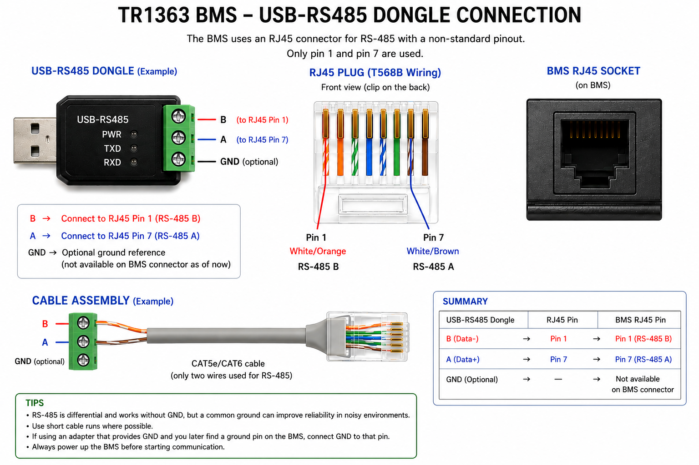

# TR1363

An open-source implementation and documentation of the TR1363 Battery Management System (BMS) protocol.

This project provides a complete Python parser, MQTT bridge, and Home Assistant integration, allowing battery data to be monitored locally without the manufacturer's Windows application.

The protocol has been reverse engineered entirely through observation and experimentation. The goal of this repository is to document the protocol, encourage collaboration, and eventually provide a complete reference implementation for the DR Battery BMS family.

> **Work in progress:** The protocol is still being decoded. While most commonly used fields are understood, some remain undocumented. Contributions and captured frames are welcome.

---

## Usage

### As a Home Assistant (MQTT) bridge

Create a `./env` file using `./.env.example` as template then run:

```bash
./homeassistant.py
```

It will query the BMS status in a loop and publish the metrics to MQTT so you can use them in Home Assistant.

### As a Python library

```python
from tr1363 import TR1363

bms = TR1363("/dev/ttyUSB0")

status = bms.read_status()

print(status.soc)
print(status.current)
print(status.cell_voltages)
```

See [example.py](example.py).

## Features

- Decode proprietary TR1363 serial protocol
- Python parser with named fields
- MQTT publisher
- Home Assistant MQTT auto-discovery
- State of Charge (SOC)
- Pack voltage
- Cell voltage monitoring
- Charge/discharge current
- Temperatures
- Status and protection flags
- Passive balancing status
- Reverse-engineered protocol documentation

---

## Motivation

The official Windows application requires proprietary software to access battery information and only provides CSV dumps of the data.

This project aims to:

- document the protocol
- eliminate dependence on the official application
- integrate the battery with Home Assistant
- make battery data available for automation and long-term logging
- understand the internal behaviour of the BMS

---

## Current Status

### Confirmed

- Frame structure
- Checksum
- Cell voltages
- Pack voltage
- Current
- Temperatures
- SOC?
- Status bitmap
- Balance bitmap

### Under Investigation

- Remaining undocumented fields
- Settings command
- Firmware differences between hardware revisions

---

## Hardware

Currently tested with:

- LFP Battery 16S LiFePO₄ battery
- CH340 USB-RS485 adapter
- Python 3.11+
- Home Assistant

Other battery models may work but have not yet been verified.

### RS-485 Wiring



The BMS uses an RJ45 connector for its RS-485 interface, however it **does not** follow the standard Ethernet (T568A/T568B) pinout. Only two pins are used for communication.

A convenient way to build a robust cable is to use a CAT5e or CAT6 cable and crimp an RJ45 plug on one end.

Since the BMS only uses two conductors, the remaining pairs may be left unconnected.

One recommended wiring is:

| RJ45 Pin | Wire Color (T568B) | Signal |
|----------|--------------------|--------|
| **1** | White/Orange | RS-485 **B** |
| **7** | White/Brown | RS-485 **A** |

Although this uses conductors from different twisted pairs, it exactly matches the BMS connector and has been verified to operate correctly.

If communication does not work, verify that your adapter uses the same A/B naming convention. Unfortunately, some RS-485 manufacturers reverse the labels. The TR1363 BMS pinout documented above has been verified experimentally.

### Adding a Ground Reference (optional)

Many inexpensive USB-RS485 adapters only expose the differential pair (A/B). Some higher quality adapters also provide a **GND** terminal.

RS-485 is designed to operate using only the differential pair, so a ground connection is **not required** for communication. However, when the inverter, BMS and USB adapter are powered from different sources, providing a common signal reference may improve communication reliability and reduce occasional framing or CRC errors.

At the time of writing, the BMS RJ45 connector only exposes pins **1** and **7**. I wasn't able to find any ground by poking the battery case with a multimeter.

However if a signal ground pin is identified in the future, it is recommended to connect it directly to the **GND** terminal of the USB-RS485 adapter.

---

## Passive balancing behavior (experimentally determined)

Extensive testing has revealed several characteristics of the passive balancing algorithm.

### Observed behaviour

- Passive balancing is only active while the BMS detects charging.
- Cells become eligible for balancing at **3.50 V**.
- Balancing stops when cell voltage reaches **3.75 V**.
- Balancing is not continuous. The BMS drives the bleed resistors with an intermittent PWM-like duty cycle.
- Under the tested conditions, the observed duty cycle is approximately **30%**.
- If charging current stops, balancing also stops.

These values are experimentally determined and may vary between firmware revisions.

### Practical implications

Because balancing is only active while charging and only within a relatively narrow voltage window, charger settings have a significant impact on balancing effectiveness.

In testing:

- A float voltage of **54.2 V** kept the highest cell within the balancing window, but charging current dropped to zero, preventing balancing.
- A float voltage of **54.3 V** maintained charging, allowing balancing to continue, although the highest cell occasionally exceeded the upper balancing threshold.

The BMS appears to regulate balancing by periodically enabling and disabling the bleed resistor rather than balancing continuously, making the effective balancing current significantly lower than the hardware bleed current. As a result, correcting large cell imbalances can require many hours or even several days of continuous charging.

## Configuration Parameters

The official Windows application allows writing configuration parameters to the BMS. Access to these settings is protected by a password.

**Default configuration password:** `666666`

> **Warning**
>
> Changing BMS parameters can permanently alter the battery's behavior and may lead to battery damage or unsafe operating conditions if incorrect values are used. Modify settings only if you fully understand their purpose.

### Confirmed Configurable Parameters

The following parameter has been successfully modified and verified:

| Parameter | Default | Verified Range | Notes |
|----------|--------:|---------------:|------|
| Cell balancing start voltage (aka "Starting V") | **3500 mV** | **3410–3500 mV** | The Windows application refuses values below **3410 mV**. |

### Experimental Findings

By lowering the balancing start voltage from **3500 mV** to **3410 mV**, the BMS begins passive balancing significantly earlier during the charge cycle. This increases the amount of time available for balancing before cells reach the upper voltage limit, potentially improving balancing effectiveness on heavily imbalanced battery packs.

## Development

`pip install -e .`

Source files stay where they are. Every change is immediately available. No reinstall necessary.

## Testing

`pytest`

## Contributing

Contributions are welcome.

Especially useful are:

- protocol captures
- firmware differences
- undocumented commands
- parser improvements
- Home Assistant integrations
- additional hardware revisions

If you have a battery that behaves differently, please open an issue and include raw protocol captures.

---

## Disclaimer

This project is completely independent of the battery manufacturer.

The protocol has been reverse engineered from publicly observable communication between the battery and the official application.

Use this software at your own risk. Writing incorrect values to a BMS can permanently damage a battery or create hazardous conditions. At present, this repository focuses on **read-only monitoring**.

---

## License

This project is licensed under the **Mozilla Public License Version 2.0 (MPL-2.0)**.

See [LICENSE](LICENSE) for details.
